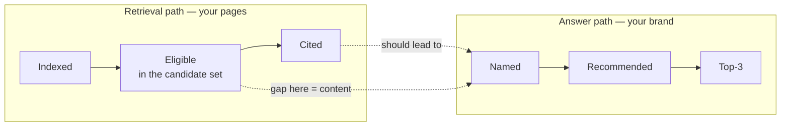
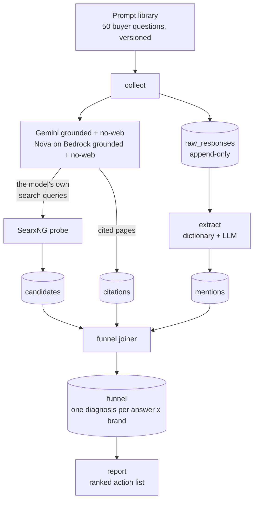
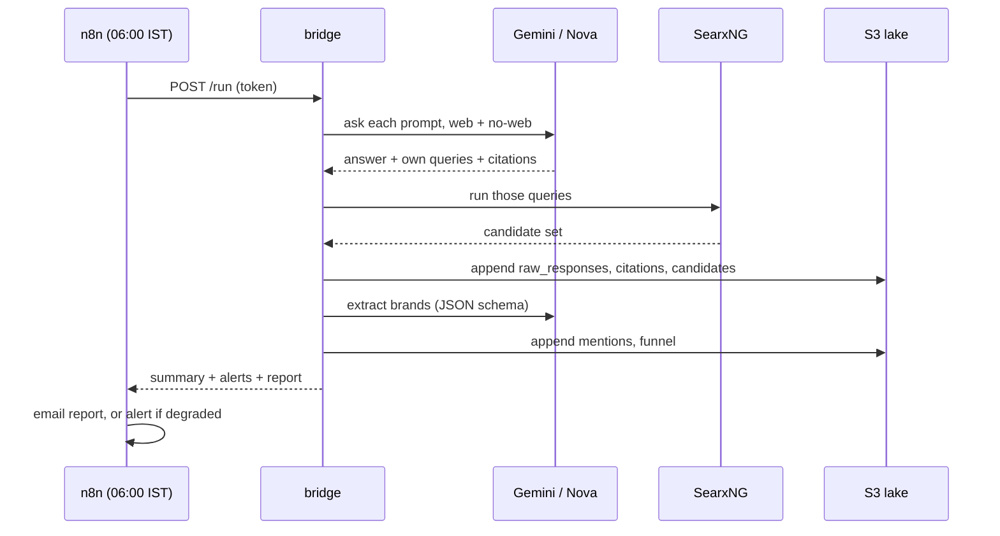
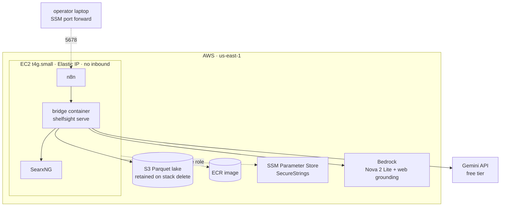

# ShelfSight

**Why AI assistants do — or don't — recommend your brand, measured at the retrieval layer.**

When a shopper asks ChatGPT, Gemini or an AI-powered search for "best sunscreen for oily skin in India
under ₹500", the assistant names three or four brands. That list is the new shelf. ShelfSight tells a
brand team whether they are on it, and when they are not, **which specific thing to fix**.

Existing AI-visibility tools report a number: "you appear in 23% of answers." ShelfSight reports a
cause: *"for 7 of your 10 category questions, no page of yours is even in the candidate set the model
searched — that is a content gap, not an authority problem."*

Design spec: [`docs/superpowers/specs/2026-09-21-shelfsight-design.md`](docs/superpowers/specs/2026-09-21-shelfsight-design.md)

---

## Why FMCG brands and their agencies should care

FMCG and D2C brands have spent thirty years optimising two shelves: the physical aisle and the retailer
search bar. A third shelf now sits in front of both, and it presents **one answer instead of a range**.
On a Nykaa results page a shopper sees forty sunscreens. Ask an assistant and you get three, with
reasons. Being fourth is the same as being invisible.

### What changes for a brand team

| Old world | AI-assistant world |
|---|---|
| Rank #7 on a category page and still get clicks | Named 4th in an answer and get nothing |
| Win the shelf by paying for placement | The assistant cites Reddit threads and review blogs you don't control |
| Category entry points measured by search volume | Buyers ask full questions: "no white cast on brown skin", "safe for acne-prone" |
| Brand awareness is the top of the funnel | The model's training memory *is* awareness, and it decays silently |

### What a team actually does with the output

Each answer gets one diagnosis, and each diagnosis has a different owner. This is the part that makes
it usable rather than interesting:

| Diagnosis | What it means | Who fixes it | Typical FMCG fix |
|---|---|---|---|
| `not_eligible` | No page of yours competes for the question the model actually searched | Content / SEO | Write the page for that buyer question, not for a keyword |
| `eligible_not_cited` | Your page was in the running and lost | Content / PR | Make the claim extractable: comparison tables, specifics, schema |
| `cited_not_named` | Your page fed an answer that recommends a rival | Content | Your page doesn't make your own case |
| `named_not_recommended` | The model knows you but won't endorse you | Product marketing | The claim the buyer asked about is missing from your copy |
| `recommended_not_top3` | Recommended, but below the fold of the answer | Brand / PR | Strengthen third-party evidence |
| `not_named` | Absent from training memory, with no live retrieval to explain it | Brand | Long-term: reviews, press, category authority |
| `winning` | Named in the top three | — | Defend it; check weekly |

### Three questions it answers that a dashboard of percentages cannot

1. **Is this a content problem or an authority problem?** If you are in the candidate set and not cited,
   writing more pages won't help. If you are not in the candidate set at all, authority work won't help.
2. **Which pages do assistants trust in our category?** Real output from a live run: `reddit.com`,
   `youtube.com`, niche dermatology review sites, then `nykaa.com`. That is a PR and marketplace brief,
   not an SEO brief.
3. **Who is winning that we don't even track?** A live run surfaced Dr. Sheth's, Lotus Herbals, Plum,
   Kama Ayurveda and Foxtale appearing in answers while absent from the tracked competitor set.

### Where it fits commercially

- **Agencies** run it per client workspace and bill the monthly action list as a retainer deliverable.
- **Brand teams** use it as the AEO equivalent of a share-of-search report, with a fix attached.
- **Cost** is roughly **$15/month of infrastructure** plus a few dollars of model usage, against a manual
  alternative of an analyst checking 50 questions across several assistants by hand.

---

## How it works

Being *cited* and being *named* are two different paths, and the interesting findings live where they
disagree. A brand can be named without being cited (training memory — fragile), or cited without being
named (your content feeding a rival's win).



The measurement nobody else makes is **Eligible**. Gemini and Nova both return the search queries they
generated. ShelfSight takes those exact queries, runs them through its own SearxNG instance, and checks
whether any of your pages were in the results the model chose from.



Stages are separate on purpose. Raw answers are never modified, and derived rows carry an extractor or
joiner version, so extraction and diagnosis can be re-run over stored answers **without paying to
collect again**.

### A day in the life



---

## Architecture on AWS

One CDK stack. No inbound ports: administration goes through SSM Session Manager, so n8n's credentials
are never exposed to the internet.



**Why these choices**

- **Elastic IP**: the retrieval probe needs a stable identity, or search engines start challenging it.
- **`language=en-IN` on every probe**: a US-hosted probe returns US results. Left unfixed it would have
  quietly measured the wrong market — the defect that matters most in this system.
- **Parquet on S3, read with DuckDB**: no warehouse to pay for, and the lake survives instance
  replacement. A day of data is a few hundred KB.
- **Secrets in SSM SecureStrings**, read at boot by the instance role: nothing in git, no long-lived keys
  on the box.
- **Instance role for Bedrock**: no expiring developer credentials in the daily path.

### Data model

| Table | One row per | Written by |
|---|---|---|
| `runs` | daily run: status, coverage, quota, cost signals | collect |
| `raw_responses` | prompt × engine × mode (append-only, never edited) | collect |
| `candidates` | URL in the candidate set for one of the model's own queries | probe |
| `citations` | URL the model actually cited | collect |
| `mentions` | brand named in an answer, with rank, sentiment, claims | extract |
| `funnel` | answer × tracked brand, with its diagnosis | funnel joiner |

Layout: `s3://bucket/lake/{table}/workspace={w}/run_date={d}/*.parquet`

---

## Running it

### On a laptop

```bash
uv sync
docker compose -f infra/searxng/docker-compose.yml up -d
export GEMINI_API_KEY=...            # Google AI Studio, free tier
uv run python scripts/smoke_gemini.py   # checks the model still returns its own queries
uv run python scripts/smoke_nova.py     # same for Nova on Bedrock (needs AWS credentials)
uv run shelfsight collect --workspace dotandkey --limit 3
uv run shelfsight extract --workspace dotandkey
uv run shelfsight funnel  --workspace dotandkey
uv run shelfsight report  --workspace dotandkey
```

`uv run pytest` runs 105 offline tests. Live checks live in `scripts/` and never run in CI.

### On AWS

```bash
aws ssm put-parameter --name /shelfsight/bridge_token   --type SecureString --value file://token.txt
aws ssm put-parameter --name /shelfsight/gemini_api_key --type SecureString --value file://gemini.txt
cd infra/cdk && cdk deploy
```

Then reach n8n through the tunnel (needs the AWS Session Manager plugin):

```bash
aws ssm start-session --target <instance-id> --document-name AWS-StartPortForwardingSession --parameters "{\"portNumber\":[\"5678\"],\"localPortNumber\":[\"5680\"]}"
```

Create the n8n owner account and an SMTP credential, then deploy the workflows:

```bash
uv run --env-file .env python scripts/n8n_deploy.py
```

### Configuration

| File | Holds |
|---|---|
| `config/config.yaml` | engines, pinned model ids, per-engine daily caps, probe settings, domain types |
| `config/workspaces/<id>.yaml` | the client brand, competitors, aliases, domains, marketplace URL patterns |
| `data/prompts_seed.csv` | the versioned prompt library |
| `.env` (git-ignored) | local secrets for the bridge and the n8n deploy |

Adding a client is a new workspace YAML. Adding a category is a new prompt set. Neither needs code.

---

## Honest limits

- **API answers are a proxy** for the consumer apps, which add memory and personalisation. Track trends,
  not absolute numbers.
- **The probe approximates** each engine's retrieval; SearxNG is not the same index.
- **Model updates move the numbers.** Model ids are pinned and recorded per row, and the smoke scripts
  check that grounding fields still exist before a real run.
- **Nova's search queries come from an undocumented field.** `scripts/smoke_nova.py` exists because of it.
- **Gemini's free tier allows ~19 requests/day**, so it covers the top 9 prompts; Nova covers all of them.
- **Extractor accuracy is not yet measured.** The target is ≥95% brand recall on 40 hand-labelled answers.
- **The seed library has 10 prompts**, not the planned 50.

## Roadmap

| Plan | Delivers | State |
|---|---|---|
| 1. Core funnel engine | collect → probe → extract → funnel → report | Built, deployed, tested |
| 2. Fix verification | Did the page we shipped move the funnel? Difference-in-differences against a control set | Designed, not built |
| 3. AWS + n8n | CDK stack, scheduled runs, email digests | Built; n8n on the instance still needs its owner account |
| 4. Dashboard | Static site over the lake with per-workspace auth | Designed, not built |

Verification (Plan 2) is what turns this from a diagnosis into a loop: record what the agency shipped,
then measure whether targeted prompts moved relative to an untouched control set, and how many days it
took to go from published to cited.
